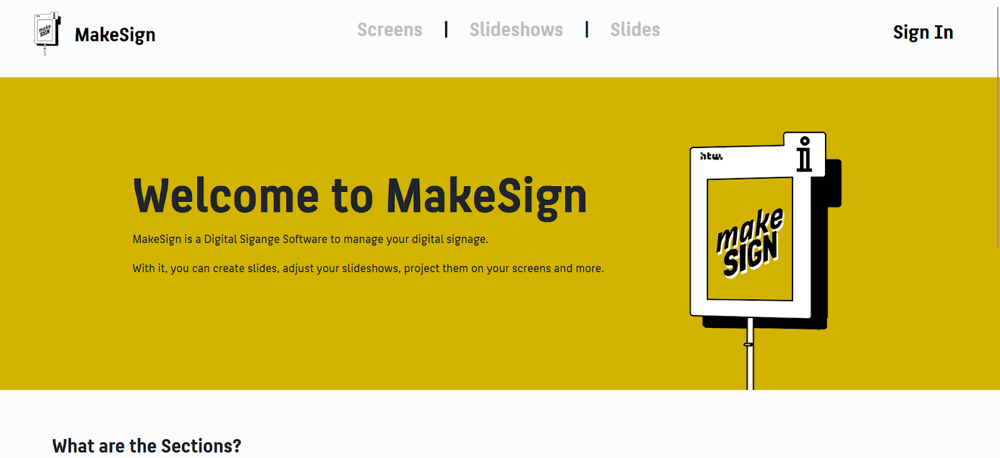
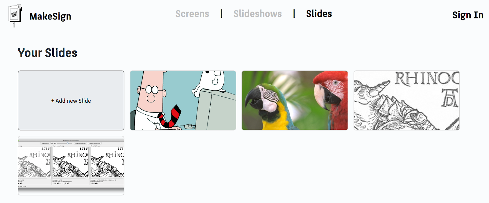
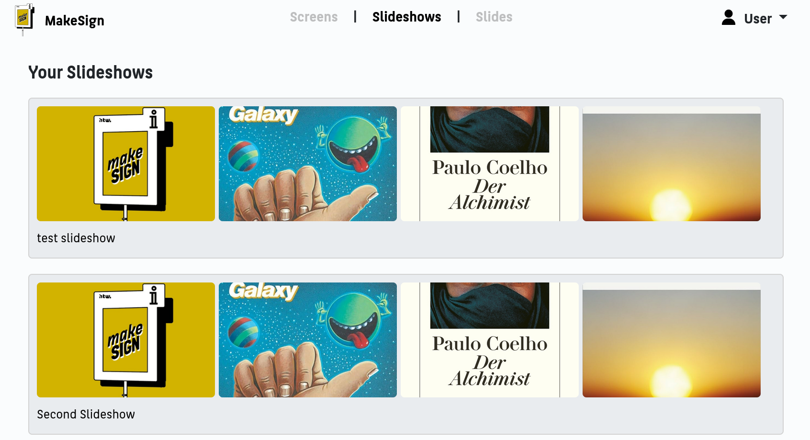
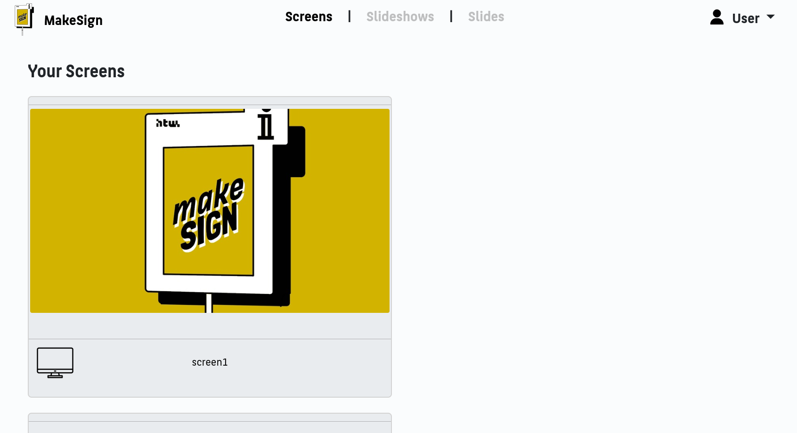
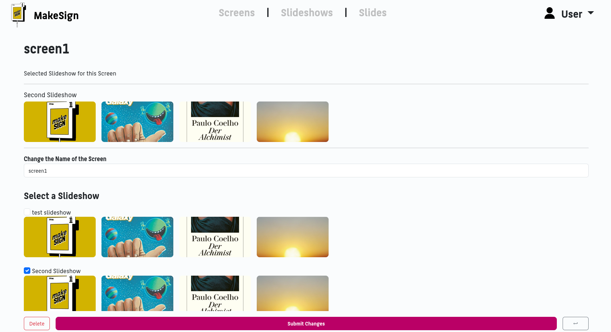

# MakeSign: Digital Signage Solution

## Overview
MakeSign is a digital signage solution developed in collaboration with IDiA to streamline how the Makerspace displays tool availability, as well as advertisements and announcements through slideshows. Using Raspberry Pis, the system displays a dashboard with real-time data and media content on monitors within the Makerspace. The application was developed using Ruby on Rails, with the dashboard created in pure JavaScript.

## Problem & Solution
The challenge was to create an intuitive system for the Makerspace team to upload images and short videos, displayed on two monitors. Additionally, the system had to show machine availability based on the booking system. Initial difficulties accessing the booking data were resolved, and we opted for a simple yet flexible dashboard design using HTML, CSS, and JavaScript. Raspberry Pi 3 B+ was chosen for its affordability and strong documentation.

## My Contributions
- **Research:** Explored existing digital signage solutions and hardware.
- **Raspberry Pi Setup:** Installed a custom GUI, integrated Eduroam certificates, and handled kiosk mode setup.
- **Upgrading Concerto:** Attempted to resolve issues resulting from upgrading Concerto to Ruby 3.3.
- **Design:** Designed the logo and web presence for the project.
- **Custom Ruby Project:** Restarted the project using a custom Ruby on Rails solution.
- **Frontend Development:** Integrated CSS, Bootstrap, and JavaScript into the Asset Pipeline.
- **Functionality:** Implemented the "Screens" feature to manage multiple slideshows across different monitors.
- **Styling & Design:** Created the frontend design and styled the interface.
- **Bug Fixes & JS Implementations:** Fixed various bugs and implemented small JavaScript features.

## Final Outcome
This project was a great learning experience, deepening my knowledge of Ruby on Rails, API integration, and frontend development. Following our successful demo at Showtime, we refined the app, adding new features like user authentication, slide duration management, and AWS integration for media storage. The end result is a robust and scalable digital signage solution tailored to the Makerspace's needs.

